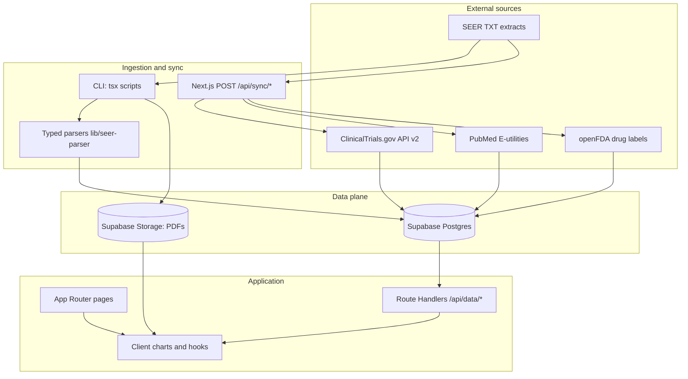

# Metastatic Breast Cancer (MBC) — Evidence & Data Platform

[](https://nextjs.org/)
[](https://www.typescriptlang.org/)
[](https://supabase.com/)
[](#)

> Full-stack research site that **aggregates population registry statistics, clinical trial metadata, regulatory labeling signals, and literature abstracts** into a single, queryable surface — with **typed ingestion pipelines**, **server-side data access**, and **interactive visualization**.

---

## Short Technical Overview

This repository implements a **content + data product** for metastatic breast cancer (MBC): curated narrative sections, **24+ primary references** with PDF assets, and a **Postgres-backed analytics layer** fed by **SEER-derived text extracts**, **ClinicalTrials.gov**, **PubMed E-utilities**, and **openFDA** drug labels. The UI is a **Next.js App Router** application; the backend is a set of **Route Handlers** that normalize third-party APIs, persist rows in **Supabase**, and expose **read-only JSON endpoints** consumed by the client through a small **`useFigureData` hook** (no direct browser calls to external APIs).

The system is designed around **repeatable ETL**: CLI scripts for bulk ingest, HTTP `POST` sync routes for operator-triggered refresh, and **post-load validation** against epidemiologically plausible ranges for key survival statistics.

---

## Key Features

- **Multi-source integration**: SEER-style survival/incidence tables, paginated **ClinicalTrials.gov API v2** sync, **PubMed** search + batched **EFetch** (rate-limit aware), **openFDA** label search with pagination.
- **Structured persistence**: Normalized tables for trials, drugs, publications, SEER slices, and a **`figure_data`** store keyed by dataset identifier for chart payloads.
- **Internal API surface**: Dedicated `/api/data/...` routes for SEER chart series, trials, drugs, publications, and parameterized figure datasets (`/api/data/figure/[key]` with an allow-listed key set).
- **Asset pipeline**: PDFs in **Supabase Storage** (public bucket) with metadata synced to a `pdfs` table; optional **offline text extraction** via `pdf-parse` for downstream numeric / NLP workflows.
- **Interactive analytics UI**: **Recharts**-based figures (survival curves, incidence trends, disparity views, trial/publication summaries) with loading/error states wired through shared hooks.
- **Evidence UX**: Section-scoped citations, reference search/filter, and bookmarking via **client-side persistence** (`localStorage`).

---

## System Architecture



**Design intent:** separate **trusted server writes** (service role) from **read paths** exposed to the browser, keep third-party complexity behind Route Handlers, and centralize figure access so components do not embed SQL or vendor SDK calls.

---

## AI / ML Components (Current + Natural Extensions)

**Today (ML-adjacent engineering):**

- **Document processing**: `scripts/extract-numbers.mjs` uses **PDF text extraction** as a bridge from unstructured literature to structured artifacts — the same boundary where production teams add **layout-aware parsing**, **table extraction**, or **LLM-assisted fact extraction** with evaluation harnesses.
- **Literature and trial corpora**: PubMed and ClinicalTrials sync produce **structured JSON** suitable as **grounding context** or **retrieval corpora** (metadata + raw payloads stored for audit/replay).

**High-leverage extensions (not yet implemented):** chunking + **embeddings**, **vector search** (e.g. pgvector) over abstracts and full text, **RAG** with citation grounding to stored DOIs/NCT IDs, **LLM orchestration** for section drafting with human-in-the-loop review, and **offline evaluation** (precision@k, nDCG, hallucination checks against stored tables).

---

## Tech Stack

| Layer | Choices |
|--------|---------|
| Framework | **Next.js 16** (App Router), **React 19** |
| Language | **TypeScript 5** |
| Styling | **Tailwind CSS 4** |
| Charts | **Recharts** |
| Data platform | **Supabase** (PostgreSQL + Storage) |
| Server client | `@supabase/supabase-js` with **service role** for server routes |
| Tooling | **ESLint**, **tsx** for scripts |

---

## Backend Infrastructure

- **Database**: Supabase Postgres holds normalized **SEER** tables, **`figure_data`** rows (per-chart series), **`mbc_trials`**, **`mbc_drugs`**, **`mbc_publications`**, and **`pdfs`** metadata.
- **Object storage**: Public **`pdfs`** bucket for reference PDFs; URLs resolved in `lib/references.ts` with encoding-safe path joining.
- **API design**: REST-style Route Handlers under `app/api/**` — **GET** for reads, **POST** for sync jobs (operator-triggered), with JSON error surfaces consistent for the `useFigureData` consumer.
- **Security posture**: **Service role key** is **server-only** (never shipped to the client). Sync endpoints are powerful; in a locked-down deployment they would sit behind **auth**, **secret headers**, **IP allow lists**, or **Vercel Cron + OIDC** (see *Future Improvements*).

---

## Deployment Details

- **Target platform**: **Vercel** (native fit for Next.js) or any Node-compatible host running `next build` / `next start`.
- **Environment variables** (typical):
  - `NEXT_PUBLIC_SUPABASE_URL`
  - `SUPABASE_SERVICE_ROLE_KEY` (server-only)
  - `NCBI_API_KEY` (optional; increases PubMed E-utilities throughput)
- **Operational pattern**: run CLI seeds/ingest in CI or a secure workstation; use **POST** sync routes for incremental refresh in controlled environments.

---

## Challenges and Engineering Decisions

1. **Heterogeneous upstream formats**: SEER text exports require **dedicated parsers** (`lib/seer-parser.ts`) and defensive filtering (year windows, curve intervals) before persistence — mirroring real-world registry ETL.
2. **API rate limits and pagination**: PubMed fetching uses **batched EFetch** with deliberate delays; ClinicalTrials.gov uses **page tokens**; openFDA uses **skip/limit** loops — all patterns that map directly to **reliable production pollers**.
3. **Chart data decoupling**: Storing figure-ready rows under **`dataset_key`** avoids shipping large static JSON in the bundle and enables **DB-driven dashboard evolution** without redeploying UI code.
4. **Validation after ingest**: Automated checks against **known epidemiologic anchors** (e.g., distant-stage and TNBC 5-year relative survival bands) catch silent parse regressions — a lightweight **data quality gate** suitable for CI.
5. **Client fetch discipline**: The UI talks only to **first-party** `/api` routes, simplifying **CORS**, **secret management**, and future **caching** policy.

---

## Performance and Scalability Notes

- **Horizontal UI scaling**: Stateless Next.js instances behind a CDN; chart data fetched on demand per view.
- **Database scaling**: Postgres indexing on foreign keys / filter columns (trials `nct_id`, figure `dataset_key`, SEER dimensions) is the primary lever as datasets grow; **read replicas** or **materialized views** are the next step for heavy analytic traffic.
- **Payload control**: Figure endpoints return **row-limited JSON**; large exports could move to **signed URLs** or **Parquet** in object storage for analyst use cases.
- **Caching**: Route Handler **`Cache-Control`** headers or **Vercel KV / Redis** could cache hot SEER slices; **ISR** or **tag-based revalidation** fits mostly-static narrative pages.

---

## Future Improvements

- **Harden sync routes**: **Authentication**, **RBAC**, **idempotency keys**, and **audit logs** for all `POST /api/sync/*` endpoints.
- **Observability**: Structured logging, **OpenTelemetry** traces around external API calls, and **dead-letter** tables for failed rows.
- **AI layer**: **Embeddings + pgvector**, **RAG** over abstracts and internal evidence tables, **evaluation notebooks**, and **human-reviewed** generative summaries.
- **Testing**: Contract tests against **frozen JSON fixtures** for parsers; Playwright smoke tests for critical charts.
- **Repo hygiene**: Root-level README pointing to `my-app/`, **GitHub Actions** for `lint` + `build`, **Dependabot**, and **CODEOWNERS** for review routing.

---

## Screenshots / Demo

_Add 3–5 high-resolution captures (hero, a SEER chart, trials dashboard, references library) or a 60s screen recording. If deployed, link the production URL here._

| Area | Suggested caption |
|------|-------------------|
| Home / definition | Narrative + primary survival visuals |
| Topic page | Section-specific evidence and figures |
| References | Searchable corpus with PDF links |
| Trials / drugs / publications | Live-fed operational dashboards |

---

## Installation Instructions

```bash
git clone <your-repo-url>
cd my-app
npm install
```

Create **`.env.local`** in `my-app/`:

```bash
NEXT_PUBLIC_SUPABASE_URL=https://<project>.supabase.co
SUPABASE_SERVICE_ROLE_KEY=<server-role-secret>
# Optional — higher PubMed throughput
NCBI_API_KEY=<ncbi-api-key>
```

**Development**

```bash
npm run dev
# http://localhost:3000
```

**Useful data commands** (require env vars)

```bash
npm run ingest:seer      # SEER TXT → Postgres (+ validation)
npm run seed-figure-data # Figure datasets
npm run upload:pdfs      # public/pdfs → Storage
npm run seed:pdfs        # references metadata → pdfs table
npm run extract-pdfs     # Offline PDF text extraction → data/extracted
```

**Production build**

```bash
npm run build
npm start
```

---

## API and System Flow Overview

**Read paths (examples)**

| Method | Route | Purpose |
|--------|--------|---------|
| `GET` | `/api/data/seer/charts/*` | Chart-ready SEER series |
| `GET` | `/api/data/figure/[key]` | Allow-listed datasets from `figure_data` |
| `GET` | `/api/data/trials` | Trial listing for UI |
| `GET` | `/api/data/drugs` | openFDA-sourced drug rows |
| `GET` | `/api/data/publications` | PubMed-sourced publication rows |

**Sync paths (operator-triggered)**

| Method | Route | Upstream |
|--------|--------|----------|
| `POST` | `/api/sync/trials` | ClinicalTrials.gov v2 (paged) |
| `POST` | `/api/sync/publications` | PubMed ESearch + EFetch (batched) |
| `POST` | `/api/sync/drugs` | openFDA (paged) |
| `POST` | `/api/sync/seer` | Local TXT + parsers → Postgres |

**Client flow:** React components → `useFigureData('/api/...')` → JSON → Recharts / tables. Sync flows are **async HTTP jobs** suitable for cron, CI, or guarded admin tools.

---

## Resume-Style Impact Summary

- Architected a **Next.js + Supabase** evidence platform combining **curated clinical content** with **automated ingestion** from **four public health / clinical data APIs** and **registry-style text pipelines**.
- Implemented **20+ Route Handlers** separating **third-party integration** from the browser, with **pagination**, **batching**, and **typed upserts** into Postgres.
- Built **repeatable ETL** (CLI + HTTP sync) with **post-ingest statistical validation** to guard against silent parser drift on high-stakes epidemiology metrics.
- Delivered a **componentized visualization layer** (numerous Recharts figures) backed by **database-driven datasets** rather than static bundles — improving maintainability as metrics evolve.
- Established patterns directly transferable to **AI product engineering**: **document extraction**, **structured corpora** for retrieval, **service-role data planes**, and a clear path to **RAG**, **embeddings**, and **evaluation**.

---

## Suggested Repository Additions (Recruiting Signal)

You asked for **missing sections** and **repo organization** ideas — consider:

| Addition | Why it helps |
|----------|----------------|
| **Root `README.md`** | One-screen map: monorepo layout, link into `my-app/`, “how to contribute”. |
| **`docs/architecture.md`** | ERD diagram, table list, sync sequence diagrams — signals **system design** depth. |
| **`LICENSE`** | Clarifies reuse; some recruiters filter on it. |
| **`CONTRIBUTING.md`** | Shows collaboration maturity. |
| **`.github/workflows/ci.yml`** | `npm run lint && npm run build` on every PR. |
| **`/supabase/migrations`** (if not present) | Versioned schema = strong **infra** signal. |
| **Badges**: build status, coverage (when tests exist) | Instant credibility. |
| **Live demo + custom domain** | Strongest conversion for hiring managers. |

---

**Disclaimer:** This is a research and engineering portfolio project. It is **not** medical advice. External data are subject to source disclaimers (SEER, NIH, FDA, ClinicalTrials.gov).
